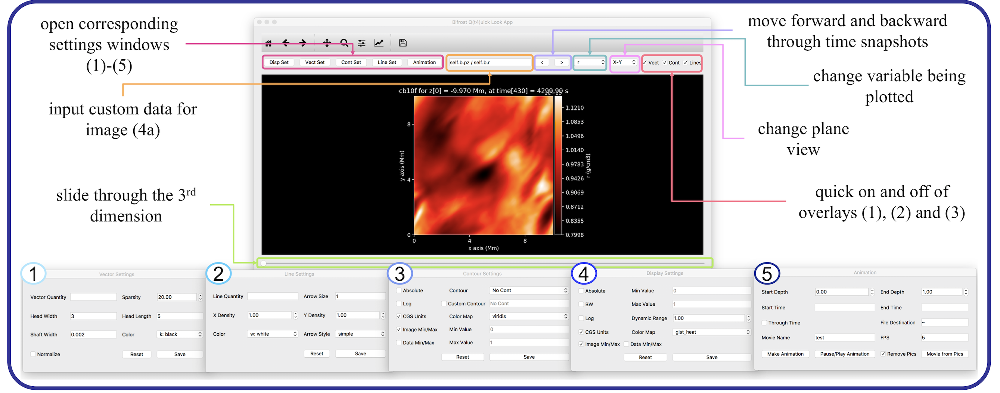

***************
bq_t5_look Tool
***************
This tool can be used to visualize and manipulate data sets produced by Bifrost simulations. Previous tools were written in IDL, but this tool is written in Python, increasing accessibility. It also has a range of added features including the creation of movies and animations.

.. figure:: finalAGUPoster.png
   
   Poster submitted to AGU Virtual Poster Showcase Fall 2017

Setup
=====
**I'm not sure how people would get access to Bifrost, is it on github?**
This tool can be found in Bifrost (which is a separate folder from helita), and requires that helita be installed in order to function. Once you have created a path for the Bifrost folder, add that path to your .cshrc, eg::
	setenv BIFROSTPATH yourpath

Launch
======
To launch the tool, call::

 python path_to_file -i path_to_snapshot

Possible extensions include:
	* -i / --input: required, points to snapshot file
	* -h / --help: returns help message
	* -s / --slice: the initial slice shown, defaults to 0
	* -e / --ebysus: code based on Bifrost
***********
Description
***********

Initial Window
==============
	* Slider: moves through third dimension
	* Variable choice: select variable to be plotted from dropdown
	* Customizable quantity: input custom data for image
	* Plane view: select plane view from dropdown
	* Control of overlays: quickly add or remove overlays specified in respective window

Overlays & Additional Settings
==============================

1. Vectors
----------
This feature allows the user to visualize non-scalar data. The user can manipulate:
	* Vector quantity (eg. p or u)
	* Arrow head width/length
	* Arrow shaft width
	* Sparsity of vectors shown

2. Lines
--------

3. Contour
----------

4. Additional Display Features
------------------------------

Movies and Animation
====================

