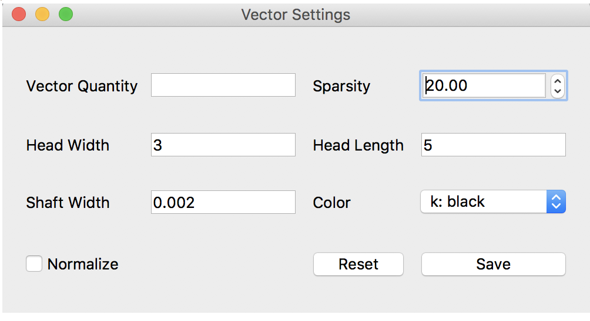
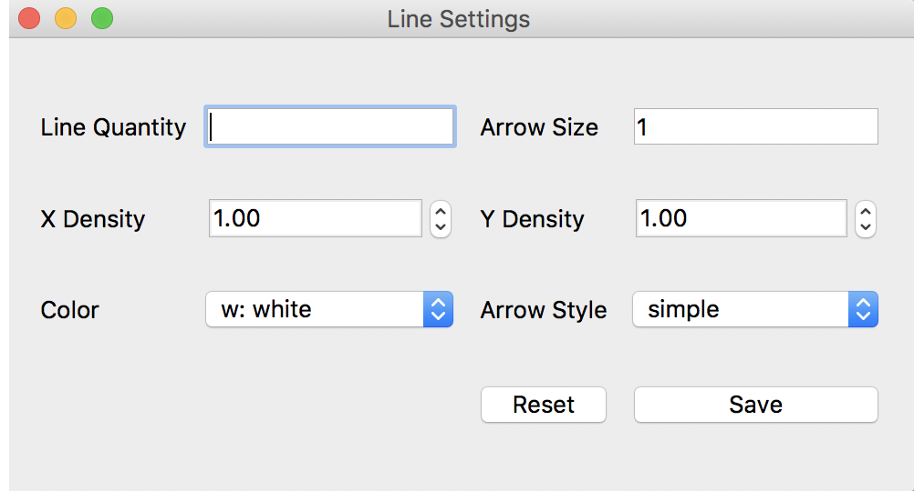

***************
bq_t5_look Tool
***************
This tool can be used to visualize and manipulate data sets produced by Bifrost simulations. Previous tools were written in IDL, but this tool is written in Python, increasing accessibility. It also has a range of added features including the creation of movies and animations.

.. figure:: finalAGUPoster.png

	Poster submitted to AGU Virtual Poster Showcase Fall of 2017

Setup
=====
**I'm not sure how people would get access to Bifrost, is it on github?**
This tool can be found in Bifrost (which is a separate folder from helita), and requires that helita be installed in order to function. Once you have created a path for the Bifrost folder, add that path to your .cshrc, eg::
	setenv BIFROSTPATH yourpath

Launch
======
To launch the tool, call::

 python path_to_file -i path_to_snapshot

Possible extensions include:
	* -i / --input: required, points to snapshot file
	* -h / --help: returns help message
	* -s / --slice: jumps directly to data[:, :, slice], defaults to 0
	* -z / --depth: finds a slice at the corresponding depth value provided in real [mM] coordinates
	* -e / --ebysus: code based on Bifrost

Description
===========

.. image:: description.png

Initial Window
--------------
	* Slider: moves through third dimension
	* Variable choice: select variable to be plotted from dropdown
	* Customizable quantity: input custom data for image
	* Plane view: select plane view from dropdown
	* Control of overlays: quickly add or remove overlays specified in respective window

Overlays & Additional Settings
------------------------------
Each of the overlays (vectors, lines, and contour) has its own corresponding pop-up settings window that can be opened from the initial page of the tool. As previously mentioned, the initial window also has the option to quickly hide/reveal a previously loaded overlay. By default, all overlays are shown once a quantity is specified.

1. Vectors
^^^^^^^^^^

	Vector Settings Window

This feature allows the user to visualize non-scalar data. The user can manipulate:
	* Vector quantity (eg. p or u)
	* Arrow head width/length
	* Arrow shaft width
	* Sparsity of vectors shown

=====

2. Lines
^^^^^^^^

	Line Settings Window

Lines offer the user another method of illustrating non-scalar data besides vector fields. The user can specify:
	* Line quantity (eg. b)
	* Line density in the X and Y directions
	* Line color
	* Arrow style and size

=====

3. Contour
^^^^^^^^^^

4. Additional Display Features
^^^^^^^^^^^^^^^^^^^^^^^^^^^^^^

5. Movies and Animation
^^^^^^^^^^^^^^^^^^^^^^^

